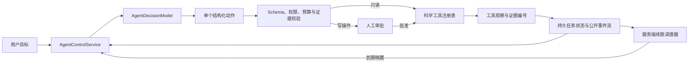

# NanoLoop 科研 Agent 控制平面

## 1. 这次重构解决什么问题

原有“科研助手”适合回答问题：程序先收集数据或检索证据，再让本地模型组织语言。它不负责持续
推进一个科研目标，也不能在多次工具调用、人工确认和后台分析之间保存任务状态。因此，即使接入
Qwen，模型也只是回答层，不是系统的控制核心。

新的 Agent 控制平面把职责重新分开：

- 决策模型读取目标、当前计划、用户输入和最近工具观察，每次只选择一个下一动作。
- 运行时校验动作、JSON Schema、权限、预算和状态转换。模型不能修改这些约束。
- 科学工具执行图像分析、统计、质量检查、报告和复现包导出。
- 所有写操作先形成持久化审批，用户批准后才执行。
- 每次决策、审批和工具观察进入公开事件流；不保存隐藏思维链。
- 模型结束任务时必须引用工具实际返回的证据编号，运行时拒绝不存在的引用。

这让模型成为“下一步做什么”的核心驱动，同时不让语言模型接管科学计算、授权或事实判定。

## 2. 运行结构



控制平面与执行平面彼此独立。更换决策模型不会改变分割模型、统计代码、数据库或报告生成器；
增加科学工具也不要求改写模型客户端。

## 3. 当前已接入的动作

| 工具 | 风险级别 | 是否审批 | 作用 |
| --- | --- | --- | --- |
| `inspect_job` | 只读 | 否 | 读取图像、比例尺、ROI、运行和模型状态 |
| `inspect_runs` | 只读 | 否 | 读取运行进度、质量和核心统计 |
| `recommend_models` | 只读 | 否 | 按图像、ROI 与目标画像返回模型候选 |
| `query_results` | 只读 | 否 | 用确定性数据工具查询统计、分布、异常和比较 |
| `create_analysis_runs` | 受控写入 | 是 | 创建不可变分割运行 |
| `create_review_run` | 受控写入 | 是 | 创建不可变复核子运行 |
| `generate_scientific_report` | 受控写入 | 是 | 生成 DOCX/PDF 科研报告 |
| `export_reproducibility_bundle` | 受控写入 | 是 | 生成内容寻址复现 ZIP |

后台分析不会让模型反复猜测进度。写工具可返回一个只读续查动作，任务进入
`waiting_for_external`；运行时同时保存 `next_wakeup_at`。API 进程内的持久续跑调度器按数据库
状态唤醒任务，因此关闭或刷新浏览器不会中断后台推进。后续只读续查不消耗模型规划步数。

工具动作有稳定 `action_id`，并在真正调用前持久化 `execution_started`。进程若在动作开始后
崩溃，幂等只读动作可用同一个动作编号安全重放；非幂等写操作不会自动重放，任务会明确失败并
要求人工核对现有运行或制品，避免重复创建分析、报告或导出。

## 4. 任务状态与数据边界

任务状态为：

`created → running → waiting_for_approval | waiting_for_input | waiting_for_external → running → completed | failed | cancelled`

SQLite 中新增三类事实：

- `agent_tasks`：目标、计划、预算、当前动作、最近观察、模型身份和最终证据；
- `agent_task_events`：只追加的公开事件流，数据库触发器禁止更新或删除；
- `agent_approvals`：待批准动作、参数、决定人和决定时间。

默认最大 12 个模型步骤、3 次失败、单次 API 调用自动推进 4 步。服务端上限不可由模型或前端
提高。`AGENT_MAX_OBSERVATION_CHARS` 是整段最近观察共享的总额，不是每条观察各自的额度；
超过时优先保留最新观察。模型适配器还会对系统提示、状态和一次格式修复执行
`AGENT_MODEL_MAX_INPUT_CHARS=12000` 的总输入上限，默认输出上限为 800 tokens。即使任务上下文、
用户输入或工具观察异常膨胀，也不会把整份持久状态直接塞给 4B 模型。

任务还保存创建时的认证模式和凭据 ID。服务端续跑前会重新检查租户、主体和凭据是否仍启用、
是否过期或撤销；授权失效后自动动作立即停止。原始凭据和密钥不会进入任务表或事件。

## 5. 更换本地模型

控制平面依赖 `AgentDecisionModel` 协议，不依赖 Qwen 类名。当前内置
`OpenAICompatibleDecisionModel`，可连接 Ollama、vLLM、llama.cpp 或其他兼容服务。

默认 `AGENT_MODEL_PROVIDER=inherit`，复用现有 `LLM_*` 连接信息，但使用独立的 Agent 提示词、
结构化输出和健康状态。也可以完全分开配置：

```bash
AGENT_MODEL_PROVIDER=openai_compatible
AGENT_MODEL_BASE_URL=http://host.docker.internal:11434/v1
AGENT_MODEL_API_KEY=ollama
AGENT_MODEL_NAME=qwen3:8b-instruct
AGENT_MODEL_JSON_MODE=true
AGENT_MODEL_MAX_INPUT_CHARS=12000
AGENT_MODEL_MAX_TOKENS=800
```

不要求鉴权的本地服务可以把 `AGENT_MODEL_API_KEY` 留空。若服务不支持
`response_format={"type":"json_object"}`，设置：

```bash
AGENT_MODEL_JSON_MODE=false
```

此时系统仍严格解析并验证模型返回的单个 JSON 动作。换成其他模型时，通常只改环境变量；只在
服务协议不是 OpenAI-compatible 时，才需要实现新的 `AgentDecisionModel` 适配器并在
`build_agent_decision_model` 中登记。未知 provider 会明确显示为 unavailable，不会阻止核心
图像分析服务启动。

针对小型本地模型，格式校验失败时默认允许一次有界修复重试
（`AGENT_MODEL_FORMAT_RETRIES=1`）；第二次仍不满足动作合同就停止本轮。该重试只修复结构，
不会放宽工具、审批、预算或证据约束。

## 6. 扩展 Python、HTTP 与 MCP 工具

公共工具合同位于：

- `app/agent/protocols.py`
- `app/contracts/agent_runtime.py`
- `app/agent/tool_registry.py`

每个适配器只需要提供：

1. `AgentToolSpec`：名称、描述、严格输入 Schema、传输类型、风险、审批要求和幂等性；
2. 对应的 Pydantic 参数模型；
3. `execute(context, arguments) -> AgentToolObservation`。

`transport` 已保留 `python`、`http` 和 `mcp`。当前只注册受信任的进程内 Python 工具；以后接入
HTTP 或 MCP 时，应把鉴权、域名白名单、超时、响应大小、重试和审计放在适配器内，不能把任意
URL、Shell、SQL 或文件系统直接暴露给模型。所有非只读工具无论使用哪种传输，都必须人工审批。
`context.action_id` 可作为外部服务的幂等键。

工具返回的 `summary` 面向用户和小模型，`data` 保留有界结构化结果，`evidence_refs` 是最终结论
可引用的事实编号。异步工具只能把控制权交给一个已注册的只读续查工具。

## 7. API 与前端

主要 API：

- `POST /api/v1/analyses/{job_id}/agent-tasks`
- `GET /api/v1/analyses/{job_id}/agent-tasks`
- `GET /api/v1/agent-tasks/{task_id}`
- `POST /api/v1/agent-tasks/{task_id}/run`
- `POST /api/v1/agent-tasks/{task_id}/input`
- `POST /api/v1/agent-tasks/{task_id}/approvals/{approval_id}`
- `POST /api/v1/agent-tasks/{task_id}/cancel`

结果页右侧“Agent”工作台显示目标、模型身份、步骤预算、计划、审批参数、等待状态、最终证据和
公开执行轨迹。等待期间前端只轮询服务端公开状态，不再负责触发下一动作。浏览器仍只访问
Next.js 同源 BFF；对应路由已进入精确白名单。健康接口分别报告 `agent_runtime` 和
`agent_scheduler`，便于区分“模型不可用”与“续跑基础设施未运行”。

## 8. 固定控制器评测

`agent-evals/controller-v1.json` 是无个人信息的固定决策集，直接载入生产环境的 8 个工具合同，
覆盖新任务检查、模型推荐、创建运行、活动运行续查、结果比较、证据收口、报告生成、缺比例尺和
拒绝写操作。评分不仅检查输出 JSON，还用运行时同一套 Pydantic 参数模型验证工具参数，并单独
统计意外写操作。

使用 Ollama 时可直接运行：

```bash
AGENT_MODEL_PROVIDER=openai_compatible \
AGENT_MODEL_BASE_URL=http://127.0.0.1:11434/v1 \
AGENT_MODEL_API_KEY=ollama \
AGENT_MODEL_NAME=qwen3:4b-instruct-2507-q4_K_M \
.venv/bin/python scripts/evaluate_agent_controller.py
```

报告默认写入 `outputs/agent-evals/controller-report.json`。只有动作合同有效率和工具参数有效率
均为 100%、意外写操作为 0、任务通过率不低于 80% 时，命令才以 0 退出；门槛可用
`--minimum-pass-rate` 调整。

2026-07-31 在本机已有的 Qwen3 4B Instruct Q4_K_M、Ollama 默认 4096 context、temperature 0
条件下，固定 10 题的第一版控制提示通过 7/10。失败分别是重复查询、已知无比例尺后重复检查、
写操作被拒绝后重复检查。v2 把这三类状态转换写成明确优先规则后，连续两次评测均达到 10/10，
动作合同和工具参数均为 10/10，意外写操作为 0。这个结果证明当前小模型可以承担受约束的下一步
决策，但只代表该固定控制器集，不等于分割科学准确性或任意开放任务已经通过。

当前系统提示为 1,347 字符，8 个生产工具合同为 6,603 字符；本轮评测平均原始状态为 7,153
字符，最大 7,298。因此输入预算仍然是 4B 部署的实际约束。换模型、改提示、改工具 Schema
或新增工具后，都应重跑此评测，而不是只做一次聊天演示。

## 9. 仍然存在的工程边界

- 当前部署合同仍是单 API 进程；任务锁和续跑调度器所有权都在该进程内。多副本需要数据库级
  租约或外部队列，不能直接同时启动多个调度器。
- 固定控制器集已建立，但仍需继续加入真实失败轨迹、多轮任务级成功率和重复运行方差，不能把
  当前 10 题结果外推成开放域能力。
- HTTP/MCP 目前是明确的适配接口，不是已经开放的任意外部执行能力。
- Agent 能编排已注册工具，但分割模型本身的科学准确性仍由独立数据集和验收指标决定。
- 外部模型服务、模型权重和联网接口仍是部署方提供的运行资产，不进入仓库或任务事件。

这些边界不影响现有分析链独立工作。Agent 模型不可用时，健康接口会单独报告
`agent_runtime=unavailable`，而图像上传、运行、结果和导出接口继续可用。
