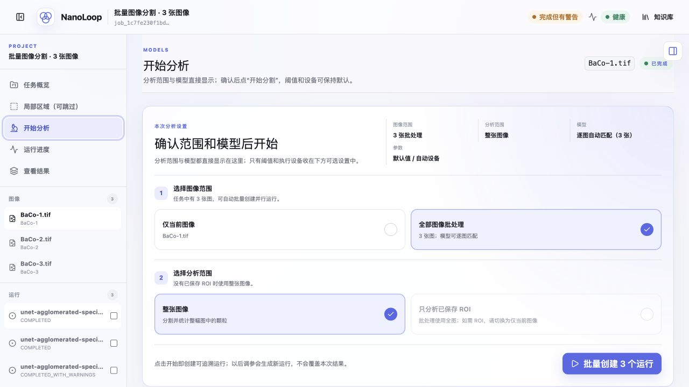

# 手册说明

这是一份合并后的完整手册。前半部分说明 NanoLoop 为什么值得做、系统怎样工作、技术证据到哪里；后半部分给出 Docker 部署、第一次分析、结果复核和故障处理方法。设计文档、部署手册和操作手册不再分散维护。

NanoLoop 面向扫描电子显微镜（SEM）颗粒图像分析。它处理的不是单独一张“待分割图片”，而是一次需要留下实验依据的分析过程：原图中哪一部分属于有效成像区，比例尺是否可信，采用了哪个模型和参数，哪些颗粒被统计，质量警告是什么，结论能否回到原图复核。系统把这些事实放进同一个工作区，再用科研助手帮助研究者阅读结果和组织下一步验证。

> NanoLoop 的工作起点是一张 SEM 图像，交付终点是一条能复核、能比较、能继续进入实验决策的数据链。

## 交付内容

最终参赛文件夹中包含一个 DOCX 手册、一个 Docker 交付包和项目展示视频。Docker 交付包是一个压缩文件，内含可直接构建的应用源码、模型资产、示例图、Compose 配置和三平台启动脚本。评审电脑首次启动时由 Docker 按本机架构下载基础镜像与依赖并完成构建。

| 交付文件 | 用途 |
|---|---|
| `NanoLoop智能体使用手册.docx` | 设计说明、科学证据、部署与操作的唯一事实源 |
| `NanoLoop_Docker交付包.tar.gz` | 联网构建源码、模型资产及完整运行材料 |
| `项目展示视频.zip` | 项目功能与操作过程的视频材料 |

手册和 Docker 包不含报名表、联系方式、个人简历、聊天记录、个人目录路径、密钥或未授权实验数据。

\newpage

# 1. 科学及应用价值：把“看图”变成可继续计算的实验数据

## 1.1 真正的瓶颈不只是分割

SEM 图像在电极、催化剂、粉体、陶瓷和沉积层研究中十分常见。研究者既要看形貌，也要比较颗粒尺寸、覆盖率、数密度和团聚趋势。人工流程往往跨越显微镜导出文件、ImageJ、脚本、表格和文字记录：先避开图像底部的仪器信息栏，再确定比例尺和分析区域，选择算法、修正分割、统计颗粒，最后解释结果是否可信。

这些环节单独看都不新奇，连起来却很容易失去口径。一张图的比例尺读错、一次 ROI 没有保存、一个后处理参数没有记录，都会让后续数字显得精确，却无法在复核时回答“当时到底算了什么”。因此，本项目把问题定义为实验数据基础设施，而不是单点模型展示。

## 1.2 面向 SOEC 材料研究的实际入口

项目最初服务于固体氧化物电解池（SOEC）阴极界面研究。颗粒形貌和团聚状态会参与影响活性位点暴露、气体传输路径、孔隙结构和界面演化；同一配方在不同制备与烧结条件下也可能产生明显不同的显微结构。只靠“看起来更细”或“似乎更致密”很难支撑批次比较，更难进入后续的结构—性能关联。

NanoLoop 把每个视野转为带单位、质量状态和来源的结构化记录，可用于：

- 比较不同配方、工艺或批次的粒径分布、覆盖率与团聚趋势；
- 快速筛出异常视野，再回到原图和实例层复核；
- 把形貌指标与温度、气氛、组分和电化学性能接入多模态数据库；
- 为材料筛选、性能预测与下一轮制备条件选择提供可追溯输入。

这条路径同样适用于催化剂颗粒、粉体粒度、烧结组织和其他以 SEM 为主要表征手段的材料场景。系统保留模型适用边界，不把某一材料上的结果写成任意显微目标的通用精度。

## 1.3 对实验流程的直接改变

传统工作流的产物往往是几张截图和一张后补的表格。NanoLoop 的产物则是一组相互校验的对象：原图摘要、有效成像区、尺度、ROI 版本、模型快照、运行配置、实例表、统计汇总、质量报告和导出校验值。研究者可以从任意一个数字回到具体视野、具体实例和具体配置。

这带来三项实际收益。第一，重复劳动减少，批量图像不再逐张搬运数据。第二，不同人员之间的统计口径更一致。第三，分析结果能够直接作为后续建模或实验设计的输入，不必重新解释每一列数据从哪里来。

## 1.4 价值判断的边界

系统不会把“完成一次工程运行”写成“已经证明跨材料泛化”。比例尺不可信时只输出像素单位；模型资产可运行不等于科学验收完成；在线摘要只能作为文献发现入口；科研助手不能替代实验验证。这些限制不是附带免责声明，而是产品逻辑的一部分。

\newpage

# 2. 一次分析怎样闭环


从上传到导出，一次任务依次经过七步：

1. **组织输入。** 一次上传 1–20 张 TIF、PNG 或 JPG 图像，每张图建立独立样品记录。
2. **识别有效区域。** 检测常见 SEM 底部仪器信息栏，读取可核验的比例尺和仪器字段；没有信息栏时保留全图。
3. **确认分析范围。** 用户可以跳过 ROI，也可以为单张图保存多个矩形区域。
4. **逐图选择模型。** 系统只从通过运行健康检查的模型中推荐；用户可以根据任务目标改选。
5. **冻结运行输入。** 原图摘要、ROI revision、模型 bundle、阈值、后处理、设备请求和随机种子写入不可变记录。
6. **计算并质检。** 模型输出经统一后处理形成实例，确定性代码计算形貌指标，质量门控先给出状态。
7. **复核与导出。** 用户查看原图、掩膜、识别叠加、实例和 Gate 图层，比较运行，向助手提问并导出审计材料。

批量任务不会强迫所有图像使用同一个模型。每张图保留自己的推荐理由、人工选择和运行身份，既能做逐图最优处理，也能为严格对照统一模型。

# 3. SEM 图像为什么不能按普通图片处理

## 3.1 有效成像区

许多仪器把比例尺、加速电压、工作距离、探测器、放大倍数和采集日期排在图像底部。若把这一区域送进分割模型，文字和比例尺很容易产生大面积误检。NanoLoop 保存完整原图供复核，同时只把有效成像区交给模型。

系统不采用固定高度硬裁剪。未检测到信息栏时保留全图；检测置信度不足时给出警告。研究者可以看到被排除的区域，而不是只得到一张来历不明的裁剪图。

## 3.2 物理尺度

系统优先读取图中可核验的比例尺。尺度存在时，面积和长度换算为 nm、µm² 等物理单位；尺度缺失或解析失败时，仅保留 `px` 与 `px²`。它不会根据文件名、材料名或相似图像猜测单位。

这个选择看似保守，却直接决定统计能否跨视野比较。一个缺少单位的结果仍可复核；一个错误的纳米值会把误差带进材料筛选和结构—性能关系。


## 3.3 ROI 是实验输入，不是临时画框

ROI 使用原图整数坐标和半开区间 `[x1:x2, y1:y2]`。每次保存都会生成新的 revision，并用比较交换防止两个页面互相覆盖。运行引用明确的 revision；分析后再改 ROI 会创建新运行，不会改写旧结果。

多个 ROI 重叠时，右侧列表决定当前编辑对象，画布只显示该框的控制点。这样既减少误选，也使“分析了哪里”成为可查询的实验事实。

\newpage

# 4. 技术深度：复杂度放在可信边界上


## 4.1 前端、BFF 与后端事实源

前端采用 Next.js。浏览器只访问同源 `/api/nanoloop/*`，服务端 BFF 再把允许的请求转发给 FastAPI。内部服务地址和共享密钥不进入浏览器环境。前端负责交互和可视化，不读取 SQLite，也不重新计算科学指标。

FastAPI 负责契约、任务编排、模型运行、质量、问答与导出。SQLite 以 WAL 模式保存任务、图像、ROI revision、不可变运行、状态事件和审计记录；文件制品使用内容摘要与数据库记录关联。排队记录本身就是持久事实，服务重启后可以继续领取未完成任务。

## 4.2 模型网关与内容寻址快照

模型注册表描述模型族、适用标签、阈值、输入要求、权重、配置和模型卡。运行前，系统校验这些文件及适配器源码摘要，发布只读的内容寻址 bundle。U-Net、实例分割和后续模型通过统一适配器接入，模型特有格式不会渗入统计层。

这个设计解决了一个常被忽略的问题：模型名称相同，不代表文件、配置和代码相同。NanoLoop 记录的是实际运行的字节和参数，而不是一个容易被覆盖的字符串标签。

## 4.3 统一实例与确定性统计

模型输出经过阈值化、连通域或实例整理、可选 watershed、最小面积过滤和边界颗粒排除，形成 canonical instances。掩膜、实例表、覆盖图、CSV 和汇总统计都从同一份 canonical 结果生成，避免“界面显示一套、导出计算另一套”。

| 指标 | 计算口径 | 解释时要注意 |
|---|---|---|
| 颗粒数 | 通过过滤后的实例数量 | 依赖实例定义与粘连分离质量 |
| 等效直径 | `d_eq = 2√(A/π)` | 将不规则颗粒转换为可比较尺度 |
| 覆盖率 | 颗粒面积 / 有效分析面积 | 受有效区、阈值和边界处理影响 |
| 颗粒数密度 | 颗粒数 / 有效物理面积 | 需要可信比例尺 |
| 周长密度 | 实例周长总和 / 有效物理面积 | 对边界质量较敏感 |
| 分布统计 | 均值、中位数、四分位数、标准差、CV | 应结合样本层级与视野数量 |

## 4.4 质量门控先于结论

每次运行先检查输入、有效区域、尺度、分割稳定性、实例数量、边界接触、面积分布和制品完整性，再展示统计。状态分为通过、完成但有警告和失败。警告不会被识别叠加图遮住。

结果页提供原图、掩膜、识别叠加、概率、实例编号、边界 Gate、实例 Gate、尺度 Gate 和不确定性等审查层。具体模型没有产生的调试层不会显示空按钮。


## 4.5 不可变运行与可重现导出


创建运行时冻结：

- 原图 SHA-256、字节长度和解析尺寸；
- 图像元数据、物理尺度、有效成像区和 ROI revision；
- 权重、配置、模型卡、适配器源码及 bundle 摘要；
- 阈值、最小面积、watershed、边界排除、设备请求和随机种子；
- 后端源码与依赖摘要。

执行时补记实际设备、确定性控制、实现版本和时间。调整任何科学输入都会创建新运行。人工修正也保存为父子运行，不覆盖模型原始输出。导出文件按精确字节生成 SHA-256；相同数据库与制品快照得到相同审计 ZIP。

\newpage

# 5. 多模型不是模型堆叠

## 5.1 模型角色

| 模型 | 当前角色 | 适合处理 | 科学状态 |
|---|---|---|---|
| Large U-Net | 高质量语义分割基线 | 轮廓清楚、面积较大的颗粒 | 有历史三视野评估；仍需统一 bundle 复验 |
| Small U-Net | 轻量语义分割 | 小颗粒或资源受限场景 | 运行资产可用；更完整科学验收待补 |
| MSBI 实例模型 | 粘连实例与计数折中 | 边界复杂、希望分离相邻颗粒 | 有九视野一次性盲测；后续版本不得复用该集合调参 |
| Agglomerated-A | 团聚区域专用 | 致密、粘连或团聚明显的视野 | 限定材料评估可用；不是通用计数模型 |

缺少权重、可选依赖或健康检查未通过的模型不会出现在推荐列表。推荐结合图像尺寸、材料与模型标签、模型可用性、历史质量和适用范围，只帮助用户缩小选择，不替用户宣布“最佳”。



## 5.2 现有评估证据

| 证据 | 结果 | 能支持什么 | 不能支持什么 |
|---|---|---|---|
| Large U-Net 历史三视野评估 | Macro Dice 0.8053；Macro IoU 0.6854 | 冻结视野上的像素分割能力 | 不是样品级或跨材料普适精度 |
| MSBI Stage I 九视野一次性盲测 | Dice 0.6279；Boundary F1 0.3774；Pseudo-instance F1 0.5399；PQ 0.4036；Count MAE 18.7778 | 与同批基线比较实例分离、计数和速度折中 | 不能用同一集合为 Stage J 宣称新泛化 |
| MSBI Stage J 十八视野验证 | Dice 0.7478；Boundary F1 0.5837；Pseudo-instance F1 0.7579；PQ 0.6277；Count MAE 4.5556 | 后继候选在验证集上的能力 | 不是新的独立测试 |
| Agglomerated-A 冻结三视野 | Macro Dice 0.8678；Macro IoU 0.7707；覆盖率 MAPE 3.77%；计数 MAPE 51.23% | 限定视野上的团聚覆盖率分析 | 不适合作为高精度颗粒计数证据 |

这些结果说明，多模型的价值不是数量，而是把任务目标写清楚。像素重叠、边界、实例分离、计数与速度可能给出不同排序。系统保留模型卡、指标和适用范围，让研究者根据当前问题选择。

## 5.3 下一轮科学验收

当前实例指标中的 GT 连通域属于 pseudo-instance，不等同于人工逐个标注粘连颗粒。下一阶段将按材料—样品—视野三级冻结新盲测集，补充触碰实例标注，预注册模型选择和统计容差，再进行一次不可回看的独立测试。系统现有模型卡、运行身份和质量接口已经为这一步准备好，但不会把“接口已具备”写成“科学问题已经解决”。

# 6. 科研助手：语言模型不能改写实验事实

NanoLoop 的助手可以回答使用问题、解释术语和讨论一般科学问题。只有问题指向当前实验、材料知识或外部文献时，才调用对应工具。

1. **实验数据工具**读取当前图像和所选运行的确定性结果，用于计数、粒径、覆盖率、排序、异常和模型比较。
2. **材料知识工具**检索受管文档，保留文档、页码、段落和规范引用；材料不匹配时先澄清。
3. **在线研究工具**检索题录和可选网页来源，用于发现相关工作，不把摘要当成全文系统综述。

实验数值必须来自数据工具。Qwen 或其他兼容模型只负责组织语言；模型不可用、超时、引用或单位校验失败时，系统退回证据摘录，不编造完整回答。

默认部署不需要大语言模型。没有 Ollama/Qwen 时，图像分析、统计、质检和导出照常工作。


\newpage

# 7. 技术落地性：从代码到现场可运行系统

## 7.1 工程闭环

NanoLoop 不是只能在开发机上演示的 Notebook。交付版本包含前端、API、数据库迁移、模型注册表、真实权重、健康检查、批量任务、持久队列、结果导出和跨平台启动脚本。评审电脑只需要 Docker 和首次构建所需的网络连接，不需要单独安装 Python、Node.js、数据库或 PyTorch。

项目采用非 root 容器、只读根文件系统、全部丢弃 Linux capabilities、`no-new-privileges`、本机回环端口和健康检查。数据、输出、日志和知识索引写入命名卷；停止容器不会删除任务和结果。

## 7.2 自动化门禁

交付基线覆盖后端单元与集成测试、前端单元与组件测试、浏览器端到端场景、Ruff、严格 Mypy、OpenAPI 契约、数据库迁移漂移、Next.js 生产构建和容器健康检查。测试数字只说明当前代码受哪些门禁保护，不替代材料领域的独立科学测试。

## 7.3 部署边界

交付包采用联网源码构建：首次启动时，Docker 根据评审电脑的处理器架构下载 Python、Node.js 和 CPU 推理依赖，再构建本机可运行的镜像。模型权重与注册表以只读方式挂载。Qwen、正式知识语料和在线研究密钥属于可选增强，不进入基础构建；缺少这些资产时，界面分别说明能力下降。

默认端口只绑定 `127.0.0.1:3000` 和 `127.0.0.1:8000`。当前交付面向可信单机，不宣称已经完成公网多租户产品化。若要开放公网，必须额外配置 TLS、用户认证、授权、限速和访问审计。

# 8. Docker 包结构与硬件要求

## 8.1 解压后会看到什么

先把外层 `NanoLoop_Docker交付包.tar.gz` 解压。内部目录包含：

| 文件或目录 | 作用 |
|---|---|
| `Dockerfile`、`app/`、`frontend/` | API 与前端的完整构建上下文 |
| `docker-compose.yml` | 构建、运行、健康检查与数据卷配置 |
| `model_artifacts/` | 模型注册表、配置、模型卡、适配器和权重 |
| `示例输入/` | 第一次验收使用的公开夹具 |
| 各系统启动/停止/检查脚本 | Windows、macOS、Ubuntu 操作入口 |
| `SHA256SUMS.txt` | 包内文件完整性校验 |

## 8.2 建议配置

- Windows 10/11、Ubuntu 22.04/24.04/26.04，或 Intel/Apple 芯片 Mac；
- 64 位处理器，开启硬件虚拟化；
- 内存至少 8 GB，建议 16 GB；
- 空闲磁盘至少 20 GB；
- Docker Desktop 或 Docker Engine + Compose v2；
- 首次构建期间保持稳定网络连接；
- 本机端口 `3000` 和 `8000` 未占用。

Docker 会根据评审电脑自动选择匹配的基础镜像并原生构建，Intel/AMD 与 Apple 芯片不需要共用同一份预制镜像。构建完成后，后续启动直接复用本机镜像，不会重复下载全部依赖。

## 8.3 安装 Docker

Windows 用户先在管理员 PowerShell 执行：

```powershell
wsl --install
wsl --update
```

重启后安装 Docker Desktop，采用 WSL 2 后端。macOS 用户根据 Intel 或 Apple 芯片下载对应 Docker Desktop。Ubuntu 用户按 Docker 官方 apt 仓库安装 Docker Engine 与 `docker-compose-plugin`。安装结束后均执行：

```bash
docker version
docker compose version
```

两条命令均能显示客户端和服务端信息，才继续下一步。Docker 官方安装页面列在附录中。

\newpage

# 9. 启动、停止与状态检查

## 9.1 Windows

1. 解压 `NanoLoop_Docker交付包.tar.gz`。Windows 11 可用资源管理器，也可用 7-Zip。
2. 打开解压后的 `NanoLoop_Docker交付包` 文件夹。
3. 确认 Docker Desktop 显示 Engine running。
4. 双击 `启动NanoLoop-Windows.cmd`。
5. 首次启动会下载基础镜像与依赖并构建，通常需要 10–30 分钟，具体取决于网络和电脑性能。看到“启动成功”后，浏览器打开 `http://127.0.0.1:3000`。

停止与检查分别双击 `停止NanoLoop-Windows.cmd`、`检查NanoLoop状态-Windows.cmd`。停止不会删除数据。

## 9.2 macOS

打开终端，把解压后的目录拖到 `cd ` 后面，然后执行：

```bash
chmod +x ./*.command ./*.sh
./启动NanoLoop-macOS.command
```

若系统拦截脚本，可在 Finder 中右键脚本选择“打开”。停止与检查分别运行 `停止NanoLoop-macOS.command` 和 `检查NanoLoop状态-macOS.command`。

## 9.3 Ubuntu

进入解压目录后执行：

```bash
chmod +x ./*.sh
./启动NanoLoop-Linux.sh
```

停止和检查：

```bash
./停止NanoLoop-Linux.sh
./检查NanoLoop状态-Linux.sh
```

## 9.4 手工复核

浏览器打开三个入口：

- 用户界面：`http://127.0.0.1:3000`
- API 文档：`http://127.0.0.1:8000/docs`
- 健康检查：`http://127.0.0.1:8000/health`

也可以运行：

```bash
docker compose ps
docker compose logs --tail 120 api frontend
```

两个服务均为 `healthy` 才表示启动完成。

# 10. 第一次使用

## 10.1 创建任务

1. 打开首页，点击“添加图像”或“选择图像开始”。
2. 从 `示例输入` 选择一张图，也可以上传自己的 TIF、PNG 或 JPG；单次最多 20 张。
3. 任务名称和样品信息均可选。第一次验收不必填写化学式。
4. 点击创建任务，进入任务概览。


## 10.2 检查图像和仪器信息

在左侧选择第一张图，核对尺寸、比例尺、仪器字段和有效成像区。若底部存在仪器信息栏，它不应进入有效区；没有信息栏时应保留全图。比例尺识别失败时结果使用像素单位，这属于受控降级，不是程序故障。

## 10.3 ROI（可跳过）

进入“局部区域”，在图像上拖出矩形。多个框重叠时，先在右侧列表选择当前 ROI，再移动或缩放；最后点击“保存全部 ROI”。若分析整张有效成像区，直接跳到下一步。

## 10.4 选择模型并运行

进入“开始分析”，阅读每张图的推荐理由、模型卡、默认阈值和科学状态。批量任务可以保留逐图推荐，也可以为了对照统一模型。同一张图需要比较时可选择多个候选。

第一次运行可保留默认参数。点击开始后，在“运行进度”查看后端状态，不要重复提交。

## 10.5 先读质量，再看数字

运行结束后进入“查看结果”。先读绿色、黄色或红色质量提示，再切换原图、掩膜、识别叠加和实例编号。统计明显异常时，先检查比例尺、有效区、ROI、边界实例和面积分布，不要直接把数字写入实验结论。

下载“实例数据”或“颗粒 CSV”可得到明细；“导出当前运行”会生成包含输入摘要、ROI、模型、参数、质量和文件校验值的审计材料。

\newpage

# 11. 怎样读懂结果

## 11.1 颗粒数不是独立真相

计数依赖实例定义。两个相接颗粒在语义分割中可能被视为一个连通域，实例模型又可能把一个团聚体拆成多个对象。因此，跨模型比较颗粒数时，要同时看识别叠加、边界质量和模型角色。

## 11.2 平均粒径不能代替分布

均值容易被少数大颗粒拉动。建议同时报告中位数、四分位数、标准差或 CV，并保留视野数量和样品层级。只有一个视野时，结果只描述该视野，不应自动外推到整批样品。

## 11.3 覆盖率与计数反映不同问题

团聚区域模型可能给出较稳定的覆盖率，却不能准确分开颗粒。现有 Agglomerated-A 证据正体现这种差异：像素与覆盖率表现较好，计数误差仍大。材料问题关注被覆盖面积时可以使用该模型；关注颗粒数量时应选择实例能力更明确的模型并人工复核。

## 11.4 比较实验条件时

至少保证图像尺度、有效区定义、ROI 规则、模型版本和后处理一致。若必须跨模型比较，应先说明为什么更换模型，并把模型作为分析变量保留。系统的运行对比和审计导出用于记录这些差异。

# 12. 科研助手和报告

在助手页面确认顶部显示的当前图像和运行。建议从可核对的问题开始：

- “概括当前运行的颗粒数、粒径和覆盖率，并指出最重要的质量警告。”
- “比较这张图的两个运行，说明差异来自模型、参数还是分析范围。”
- “哪些结果可以直接引用，哪些还需要回到原图或增加视野验证？”

涉及当前实验数字时，回答应出现数据证据入口。材料知识没有命中受管语料时，助手应明确说明限制。在线研究只用于发现来源，不自动把摘要升级为确定结论。

生成科研报告前，先勾选要纳入的运行。后端汇总每个视野的指标、质量状态、异常和识别叠加，再由本地 Qwen 在冻结证据范围内整理文字。Qwen 未连接或证据校验失败时，系统不会用一段模板伪装成正式解读。

## 可选：启用本地 Qwen

安装 Ollama 后拉取所需 Qwen 模型，并在启动前设置环境变量。

macOS / Ubuntu：

```bash
export NANOLOOP_ENABLE_LOCAL_QWEN=1
export NANOLOOP_COMPOSE_LLM_MODEL="本机 ollama list 中的精确模型名"
./启动NanoLoop-Linux.sh
```

Windows PowerShell：

```powershell
$env:NANOLOOP_ENABLE_LOCAL_QWEN = "1"
$env:NANOLOOP_COMPOSE_LLM_MODEL = "本机 ollama list 中的精确模型名"
.\启动NanoLoop-Windows.cmd
```

没有 Qwen 时保持默认证据摘录模式即可。

# 13. 评审快速验收路线

在 90 秒内完成以下动作，可以覆盖主链：

1. 启动 Docker，确认前端与 API 健康。
2. 上传 `示例输入` 中的图像。
3. 在任务概览核对有效成像区和比例尺。
4. 跳过或保存一个 ROI。
5. 查看逐图模型建议，启动一个默认模型。
6. 在结果页先读质量状态，再看识别叠加和统计。
7. 下载颗粒 CSV 和当前运行审计包。
8. 向助手提问：“概括当前结果，并说明限制和下一步验证方式。”

这条路线分别对应科学与应用价值、技术深度、技术落地性和演示效果：有真实问题入口，有可复核算法链，有可运行交付，也有清楚的结果表达。

\newpage

# 14. 常见问题

| 现象 | 常见原因 | 处理顺序 |
|---|---|---|
| 提示 Docker unavailable | Docker 未安装或未启动 | 打开 Docker；等待 Engine running；重试 |
| 端口 3000 或 8000 被占用 | 其他本地服务正在监听 | 关闭占用程序；不要同时启动两套 NanoLoop |
| 构建时下载失败或超时 | 网络不稳定、镜像站或依赖站暂时不可用 | 保持 Docker 运行并重新执行启动脚本；Docker 会复用已完成的构建层 |
| API 健康但前端打不开 | 前端尚在启动 | 等待 1–2 分钟；运行状态检查脚本 |
| 模型卡显示不可用 | 权重、依赖或摘要校验失败 | 检查 `model_artifacts` 完整性；查看 API 日志 |
| Qwen 未连接 | Ollama 未运行或模型名不一致 | 执行 `ollama list`；复制精确名称；重启 |
| 结果只有 px | 没有可信比例尺 | 回到元数据核对；不要把 px 当作 nm |
| 图像无法读取 | 文件损坏、伪装格式或超过上限 | 重新导出 TIF/PNG；查看日志中的 request_id |

查看持续日志：

```bash
docker compose logs --follow api frontend
```

按 `Ctrl+C` 只退出日志查看，不会停止服务。

## 数据保留与清空

正常停止使用随包脚本，任务和结果保留在命名卷中。下面的命令会删除命名卷数据：

```bash
docker compose down -v
```

除非已经备份且明确要恢复出厂状态，否则不要执行。

# 15. 隐私与安全

- 交付包不含个人姓名清单、联系方式、报名表、个人简历或本机目录。
- 不含 `.env`、API 密钥、访问令牌、浏览器 Cookie、运行数据库和本地日志。
- Docker 构建上下文只包含运行所需源码和公开交付模型资产，不包含 Git 历史、测试缓存或开发环境文件。
- 默认只绑定本机回环地址，局域网其他设备不能直接访问。
- 在线研究只发送当前问题文本，不发送 SEM 原图、模型权重或运行制品。
- 上传未公开实验数据前，使用者仍应按所在实验室的数据管理制度处理。

# 16. 当前结论与下一步

NanoLoop 已经把一次 SEM 颗粒分析组织成可复核的数据对象：输入范围明确，模型与参数可追溯，统计由确定性代码产生，质量状态先于结论，助手只能在证据边界内解释，Docker 能在独立电脑上启动。

下一阶段的重点不是继续增加模型名称，而是完成更严格的材料—样品—视野分层盲测，把形貌指标与工艺和电化学性能接入同一数据结构，并在授权范围内连接实验计划与设备日志。目标是让“看见颗粒”最终变成“提出可验证的下一步实验”。

AI4S 的价值不只取决于模型能否给出答案，还取决于答案是否能回到实验现场，经得起下一次测量。NanoLoop 从显微图像这一环开始，把证据、计算和操作放在同一条线上。

# 附录 A：主要技术栈

- 前端：Next.js、React、TypeScript、React-Konva；
- 后端：FastAPI、Pydantic、SQLAlchemy、Alembic、SQLite WAL；
- 图像与模型：PyTorch / TorchScript、OpenCV、NumPy、可插拔 Adapter；
- 助手与检索：本地 Qwen/OpenAI-compatible API、FTS5、可选 FAISS、Crossref；
- 交付与质量：Docker Compose、Pytest、Ruff、Mypy、Vitest、Playwright。

# 附录 B：关键边界清单

- 缺少比例尺时只输出像素单位；
- 模型 `ready` 表示运行资产可用，不等于科学验收完成；
- Qwen 不计算实验数字，实验数值来自确定性工具；
- 在线题录和摘要用于发现来源，不等于取得论文全文；
- 运行、ROI 和人工修正均保留版本，不覆盖旧结果；
- 当前部署面向可信单机，不宣称公网多租户产品化。

# 附录 C：Docker 官方安装入口

- Windows：`https://docs.docker.com/desktop/setup/install/windows-install/`
- macOS：`https://docs.docker.com/desktop/setup/install/mac-install/`
- Ubuntu：`https://docs.docker.com/engine/install/ubuntu/`

本手册中的 Docker 安装前提按 2026 年 7 月官方文档核对。若操作系统或 Docker Desktop 后续升级，以官方页面为准；NanoLoop 自身的启动、使用和结果复核步骤以本手册为准。

# 附录 D：提交与现场验收检查单

提交前只检查最终文件夹，不从开发目录直接挑文件。外层目录应只有 DOCX 手册、Docker 压缩包和项目展示视频 ZIP。确认 DOCX 文件属性不含个人作者或修改者，正文没有姓名清单、联系方式、账号、个人路径和密钥。

Docker 包按以下顺序检查：

1. 校验 `SHA256SUMS.txt`，确认构建源码、模型权重、注册表和启动脚本均完整；
2. 在一台只有 Docker 和网络连接的电脑运行启动脚本；
3. 等待 Docker 下载依赖并完成构建，确认 API 与前端均达到 `healthy`；
4. 上传随包示例图，完成元数据识别、模型选择、运行、结果查看和 CSV 导出；
5. 停止后再次启动，确认任务与结果仍在；
6. 检查浏览器地址仅为 `127.0.0.1`，未向局域网开放；
7. 检查镜像标签、创建历史和容器环境，不应出现个人姓名、邮箱、主机目录或访问令牌。

现场演示前再做一次冷启动。提前关闭无关浏览器标签、通知和个人软件，只保留 Docker、NanoLoop 与演示输入。若可选 Qwen 未就绪，使用证据摘录模式完成主链，不要临时改变分析口径。评审追问模型精度时，同时说明数据层级、指标口径和不能外推的范围；追问应用价值时，从 SOEC 形貌数据怎样进入材料筛选和下一轮实验讲起。

最终验收标准不是“页面能打开”，而是一次分析能够从原图走到质量、统计、证据和导出，并在另一台电脑上重复完成。

| 验收项 | 通过条件 |
|---|---|
| 文件范围 | 外层只有手册 DOCX、Docker 压缩包和项目展示视频 ZIP |
| 隐私 | 正文、属性、镜像和环境中均无个人信息或密钥 |
| 联网部署 | 仅需 Docker 与网络即可按评审机架构完成首次构建 |
| 科学主链 | 原图、尺度、ROI、模型、质量、统计和导出可以逐项复核 |
| 数据保留 | 停止并再次启动后，任务和运行记录仍可访问 |
| 表述边界 | 精度、适用材料、数据层级和待验证事项没有被夸大 |
