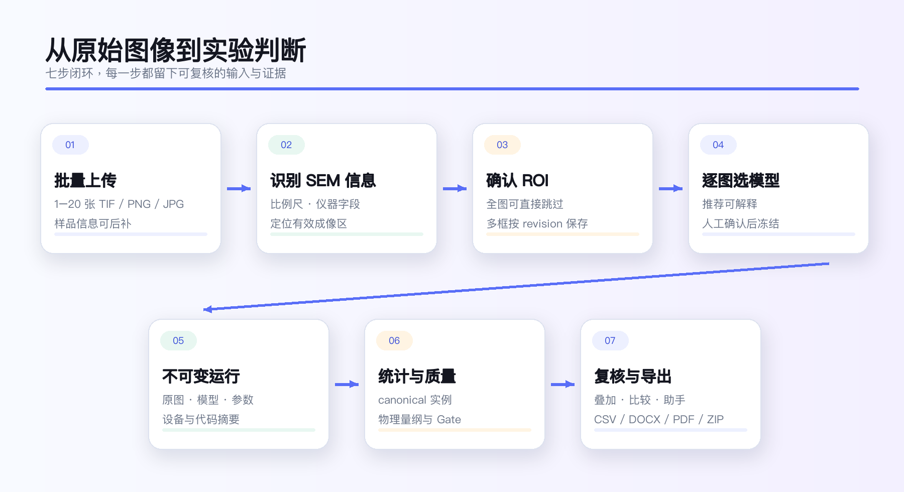
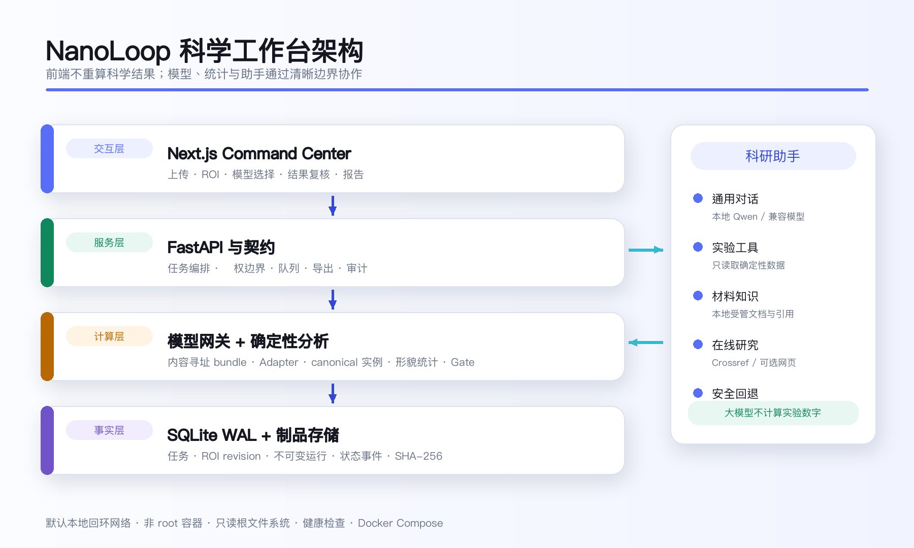
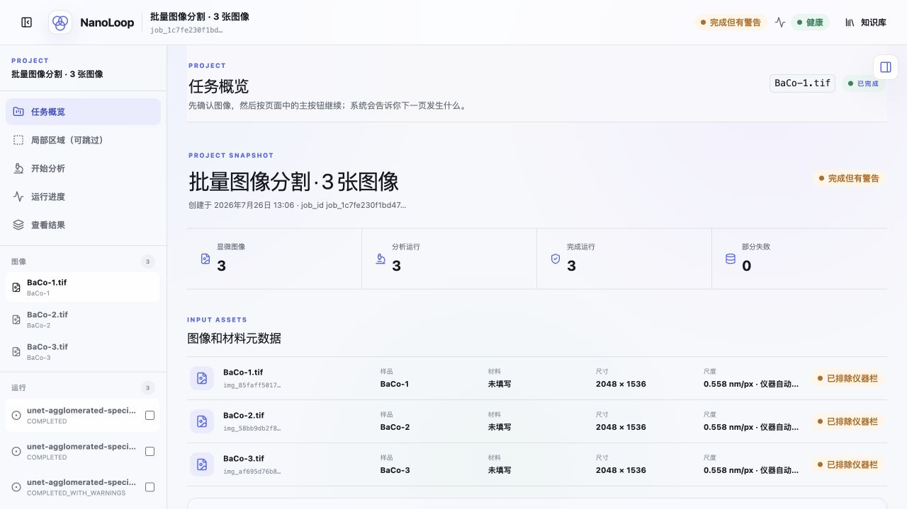
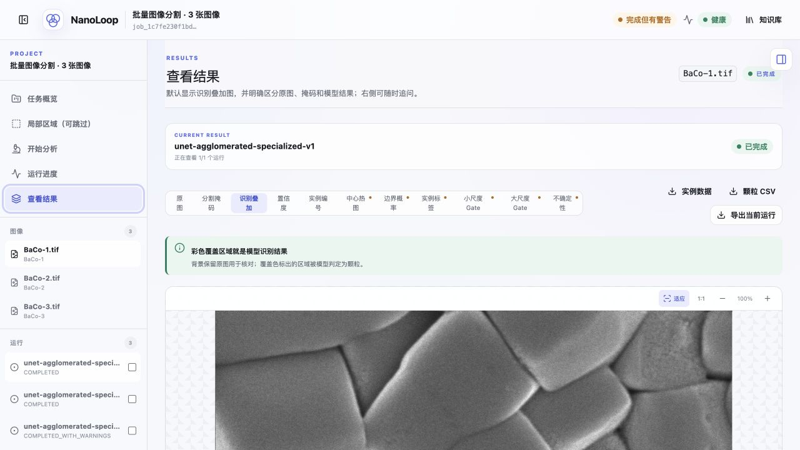
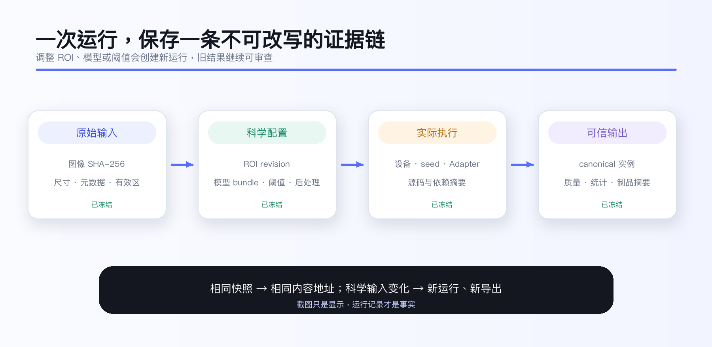
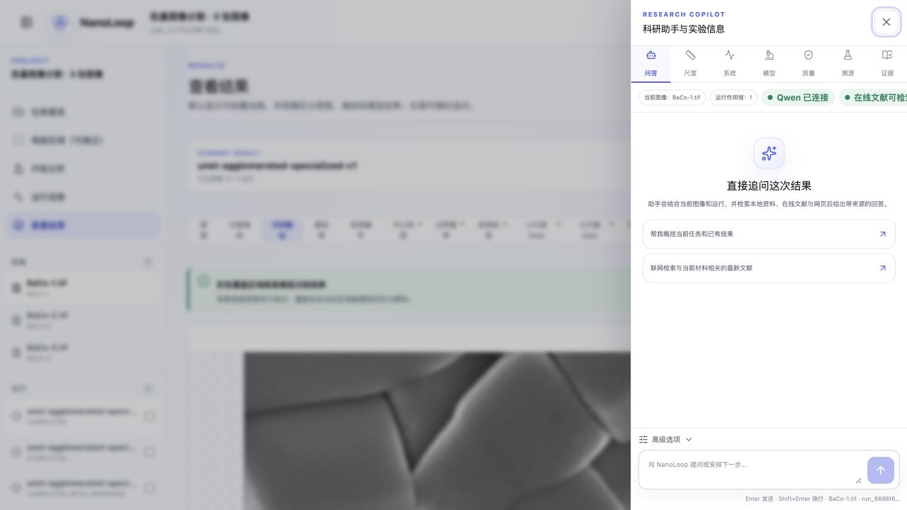
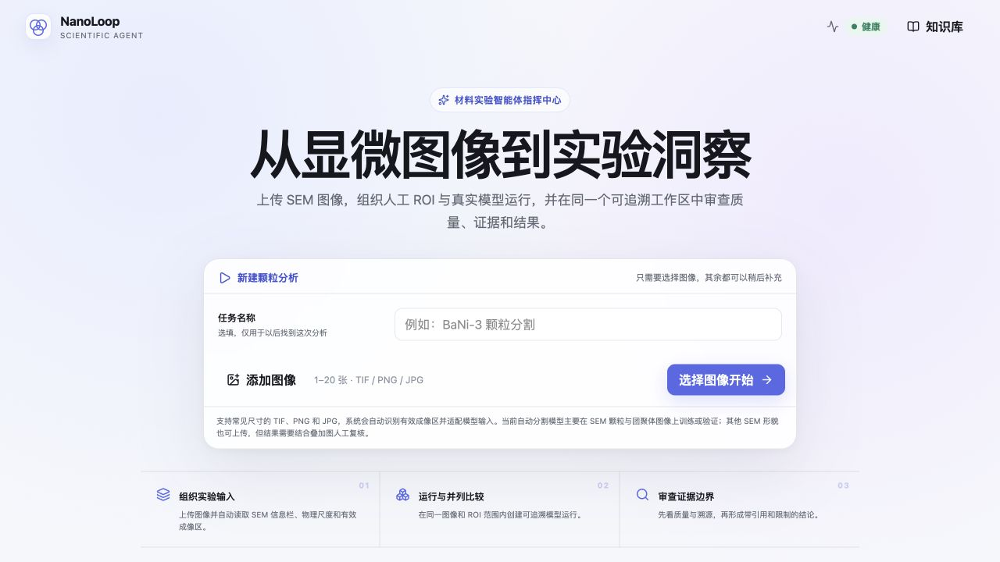

# 摘要

我们最初面对的并不是“缺少一个分割模型”，而是模型结果很难真正进入实验判断。实验人员需要先从扫描电子显微镜（SEM）图像中避开仪器信息栏，再判断物理尺度、手工划定区域、选择算法、整理颗粒统计，最后还要解释结果是否可信。一个环节出错，后面的数字就可能看起来精确，却没有科学意义。

NanoLoop 把这条割裂的流程收进一个可追溯工作区：上传原始图像后，系统识别 SEM 底部仪器信息与比例尺，只把有效成像区交给分割模型；每张图像可以采用不同模型和参数；颗粒数、等效直径、覆盖率、数密度等指标由确定性代码计算；质量门控、运行配置、模型版本、原图摘要和导出文件都被保留下来。科研助手首先是可以自然交流的通用对话对象，在问题涉及当前实验时，再调用数据工具、材料知识库与在线文献检索，并把结论和证据边界一起交给用户。

这项工作的应用起点来自深圳大学 AI4S 孵化项目“跨模态 SOEC 高温 CO₂ 电解阴极界面调控与反演式智能优化研究”。阴极材料的颗粒形貌会影响活性位点、气体传输和界面演化；但 SEM 图像数量大、人工统计慢、不同人之间口径不一。NanoLoop 试图补上的，正是从显微图像到材料筛选和后续多模态建模之间的那一段“实验数据基础设施”。

> 一句话概括：NanoLoop 不是给图片套一个红色掩膜，而是让一次图像分析能够被看懂、被复核、被比较，也能在下一轮实验里继续使用。

# 1. 从实验问题出发

## 1.1 为什么 SEM 颗粒统计值得被重新做一遍

在电极、催化剂、粉体与功能材料研究中，SEM 图像经常承担两类任务：一类是直观展示微观形貌，另一类是给出颗粒尺寸、数量、覆盖率等可比较指标。前者可以依靠经验观察，后者却必须面对三个现实问题。

- 图像并不只有“样品”。比例尺、加速电压、工作距离、探测器、放大倍数和日期等信息往往排在底部，若直接参与分割，会制造大面积误检。
- 同一种材料也可能出现小颗粒、团聚区域、粘连实例或复杂基底，统一套用一个模型并不稳妥。
- 一个结果是否能进入论文或实验记录，不只取决于掩膜好不好看，还取决于尺度是否可靠、参数是否冻结、质量警告是否被保留，以及别人能否重现。

传统做法通常在 ImageJ、脚本、表格和聊天工具之间来回切换。一次分析能做完，但很难形成统一的事实链。NanoLoop 的设计目标不是取代研究者，而是减少低价值的重复劳动，让研究者把注意力放在“这个结果意味着什么、下一步实验怎么验证”上。

## 1.2 本项目的应用场景

本项目面向以 SOEC 阴极材料为代表的显微形貌分析场景，并保留向催化材料、陶瓷、粉体、沉积层和其他 SEM 图像任务扩展的接口。当前竞赛版本重点处理颗粒及团聚区域的分割、形貌统计和证据审查；它不是一个对任意显微目标都已经完成科学验收的万能模型库。

对于 SOEC 研究，NanoLoop 可把多批次、不同配方或不同烧结条件下的 SEM 图像整理为统一数据对象，为以下工作提供更稳定的输入：

- 比较颗粒尺寸、覆盖率和团聚趋势；
- 发现异常视野并回到原图复核；
- 将形貌指标与电化学性能、工艺参数共同进入多模态数据库；
- 为材料筛选、性能预测和下一轮实验设计提供可追溯依据。

# 2. 我们怎样定义“完成”

竞赛版本的“完成”指工程闭环可独立运行，而不是宣称所有材料上的科学泛化已经结束。我们采用四条验收线：

| 验收线 | 竞赛版本必须做到 | 不做的夸大表述 |
|---|---|---|
| 输入可信 | 原图、元数据、有效成像区和 ROI 都能复核 | 不把文件名或猜测当作物理尺度 |
| 计算一致 | 掩膜、实例表与汇总统计来自同一后处理结果 | 不让前端重新计算科学指标 |
| 过程可追溯 | 模型、参数、代码、原图摘要、质量与导出均留痕 | 不把一次成功运行等同于普适准确率 |
| 结论有边界 | 数据结论、知识引用、警告和下一步建议同时出现 | 不用大模型编造实验数字或文献来源 |

这一定义决定了系统结构：模型只是执行链中的一部分，元数据、尺度、质量、证据和运行身份与模型同等重要。

\newpage

# 3. 从上传到实验判断的闭环

系统将一次任务拆成七个连续步骤：

1. **组织输入。** 用户一次上传 1–20 张 TIF、PNG 或 JPG 图像，系统为每张图像创建独立样品记录。
2. **识别仪器信息。** 对常见 SEM 底部信息栏进行检测，读取比例尺与可用仪器字段，并记录有效成像区；没有信息栏时保留全图。
3. **确认分析范围。** 用户可跳过 ROI，或为当前图像建立多个矩形区域；右侧列表负责选择，画布只调整当前框，减少重叠 ROI 误选。
4. **选择模型。** 系统根据图像与可用模型给出逐图建议；用户仍能查看模型卡、适用范围和证据等级后确认。
5. **冻结运行。** 原图 SHA-256、ROI revision、模型 bundle、阈值、后处理、实际设备和随机种子被写入不可变运行记录。
6. **计算与质检。** 模型输出经统一后处理形成实例，随后计算确定性指标并执行质量门控。
7. **复核与导出。** 用户在原图、概率图、掩膜、识别叠加和实例层之间切换，比较运行、追问助手并导出 CSV、DOCX、PDF 或审计 ZIP。

这条路径既支持单图精细复核，也支持同一任务内的批量处理。批量任务不会被迫共用一个模型；每张图像保留自己的推荐与运行身份。

# 4. 系统架构

## 4.1 前端与同源边界

前端采用 Next.js。浏览器只访问同源 `/api/nanoloop/*`，由服务端 BFF 把允许的请求转发给 FastAPI。API 地址、共享密钥和内部服务名不暴露在浏览器环境中。前端负责交互与可视化，不读取 SQLite，也不重算颗粒统计。

## 4.2 后端事实源

FastAPI 负责契约、鉴权边界、任务编排、模型运行、质量、问答与导出。SQLite 以 WAL 模式保存任务、图像、ROI revision、不可变运行、状态事件、查询审计和凭据元数据；文件制品使用内容摘要和数据库记录建立关联。排队记录本身就是持久事实，服务恢复后可以继续领取尚未完成的任务。

## 4.3 模型网关与适配器

模型注册表描述模型族、变体、适用标签、阈值、输入要求、权重与模型卡。运行前，系统核对权重、配置、模型卡和适配器源码摘要，将其发布成只读的内容寻址快照。U-Net、实例分割与未来模型通过统一适配器接口接入，避免某个模型把自身特殊格式泄漏到统计层。

## 4.4 确定性分析与科研助手

分割后处理生成统一实例集合，形貌分析只消费该集合。科研助手与分析链分离：普通交流由本地或兼容模型直接回答；涉及当前实验数字时必须调用确定性数据工具；涉及材料知识时检索本地知识库与可选在线来源。大模型负责组织语言，不负责“算出”颗粒数。

# 5. SEM 图像不是普通图片

## 5.1 有效成像区识别

绝大多数仪器导出的 SEM 图像在底部带有白色或浅色信息栏。NanoLoop 通过版式与图像特征定位该区域，将“成像区”和“仪器区”分别保存。分割只作用于成像区；结果页仍显示完整原图，让用户知道系统排除了哪里、为什么排除。

若图像没有信息栏，系统不会机械裁掉固定高度，而是保留全图并在元数据中标记未检测到仪器区。若检测置信度不足，界面给出警告而不是悄悄裁剪。

## 5.2 尺度与仪器字段

系统优先使用可核验的 SEM 标注读取物理尺度，并可保留探测器、加速电压、工作距离、放大倍数、孔径、仪器型号和采集日期。竞赛示例中，系统从 2048×1536 图像识别出 100 nm 比例尺，并定位底部 `y=1401…1536` 的仪器信息区。

比例尺缺失或解析失败时，系统只输出 `px` 与 `px²`，不会从材料名、文件名或相似图片推测纳米单位。对实验人员而言，少一个带单位的数字，比多一个错误的物理结论更安全。

# 6. ROI：研究者保留最后决定权

ROI 采用原图整数坐标与半开区间 `[x1:x2, y1:y2]`。用户可在画布拖出多个框，在右侧列表选择当前 ROI，再用鼠标移动或缩放。只有被右侧选中的框显示编辑控制点，避免多个重叠框在画布上争抢点击。

每次保存都会生成新的 revision，并使用比较交换（CAS）避免两个页面互相覆盖。运行引用具体 revision；分析完成后再改框，不会修改旧结果，而是创建新运行。这样，ROI 不再是截图上难以追溯的一条线，而是实验输入的一部分。

# 7. 不是“所有图都用同一个模型”

## 7.1 可用模型角色

| 模型 | 当前角色 | 更适合的图像特征 | 科学状态 |
|---|---|---|---|
| Large U-Net | 高质量语义分割基线 | 轮廓清楚、面积较大的颗粒 | 有历史三视野独立评估；仍需当前统一 bundle 复验 |
| Small U-Net | 轻量、较快的语义分割 | 小颗粒或资源受限场景 | 运行资产可用；Small-B 科学验收待完成 |
| MSBI 实例模型 | 粘连实例与计数折中 | 边界复杂、希望分离相邻颗粒 | 已做一次九视野盲测；新版本不得复用该测试集调参 |
| Agglomerated-A | 团聚区域专用 | 致密、粘连或团聚明显的视野 | 私有资产完成运行冒烟与限定材料评估；非通用计数模型 |

YOLO-Seg 与 SAM2 接口保留在后端注册表中供工程审计，但缺少权重、可选依赖或运行健康检查未通过时，不会出现在“开始分析”页面，也不会进入推荐候选集。

## 7.2 逐图推荐，而不是静默替用户决定

批量上传后，系统为每张图像生成推荐。推荐综合图像尺寸、有效区域、材料与模型标签、模型可用性、历史质量和适用范围；只从健康且 bundle 校验通过的模型中选择。推荐是“帮助用户缩小选择”，不是自动把某个模型宣布为最佳。

界面同时显示推荐理由、默认阈值、最小面积、输入尺寸、模型卡备注和科学证据状态。用户可以保留逐图建议，也可以为了严格对照而手动让多张图使用同一模型。运行创建后，推荐结果和人工选择均进入配置。

\newpage

# 8. 数字怎样从掩膜里产生

模型输出经过阈值化、连通域/实例整理、可选 watershed、最小面积过滤和边界颗粒排除，形成 canonical instances。公开的掩膜、实例表、覆盖图、CSV 和汇总统计都从同一 canonical 结果生成。

系统支持的核心指标包括：

| 指标 | 计算口径 | 主要用途 |
|---|---|---|
| 颗粒数 | 通过过滤后的实例数量 | 比较颗粒丰富程度；依赖实例定义 |
| 面积与等效直径 | `d_eq = 2√(A/π)` | 将不规则颗粒转为可比较尺度 |
| 覆盖率 | 颗粒面积 / 有效分析面积 | 描述表面被颗粒占据的程度 |
| 颗粒数密度 | 颗粒数 / 有效物理面积 | 跨视野比较，要求可靠尺度 |
| 周长密度 | 实例周长总和 / 有效物理面积 | 反映界面复杂度，受边界质量影响 |
| 分布统计 | 均值、中位数、四分位数、标准差、CV | 批次比较与异常视野筛查 |

物理尺度存在时，系统输出 nm、µm² 等单位；尺度缺失时保留像素单位并限制跨图比较。边界排除前后的诊断分开保存，用户可以知道“哪些实例被排除”而不是只看到最终数字。

# 9. 质量门控先于结论

每次运行先形成质量结论，再展示统计值。质量门控检查输入、有效区域、尺度、分割稳定性、实例数量、边界接触、面积分布和可用制品。结论分为通过、完成但有警告和失败；警告不会被漂亮的叠加图遮住。

结果页支持原图、分割掩膜、识别叠加、置信度、实例编号、中心/轮廓、边界 Gate、实例 Gate、小尺度 Gate、大尺度 Gate 和不确定性等审查层。研究者可以快速定位“数字为何异常”。

示例 BaCo-1 运行给出 3 个实例、0.894 µm² 有效区域、3.356 µm⁻² 数密度、39.65 nm 平均等效直径和 0.43% 覆盖率。这些数字只用于说明真实计算链已经接通，不代表该模型在所有 BaCo 样品上都达到同等质量。

# 10. 一次运行为什么不能被改写

运行创建时，系统冻结：

- 原始图像 SHA-256、字节长度与解析尺寸；
- 图像元数据、物理尺度、有效成像区和 ROI revision；
- 模型权重、配置、模型卡、适配器源码及内容寻址 bundle；
- 阈值、最小面积、watershed、边界排除、设备请求与随机种子；
- 后端源码与依赖摘要。

执行时再记录实际设备、确定性控制、后端实现、时间与运行 bundle 摘要。调整任何科学输入都会创建新运行，旧运行继续可审查。人工修正掩膜也以父子运行保存，不会覆盖模型原始输出。

导出按精确文件字节和 SHA-256 生成内容地址；相同数据库与制品快照会得到相同 ZIP，不同结果不会意外覆盖旧下载。这使“截图看起来一样”和“科学输入确实一样”成为两件可以分别验证的事。

# 11. 科研助手：先会对话，再谈增强

NanoLoop 的助手首先是一个通用对话对象。用户可以问系统怎么用、请它解释术语，也可以讨论一般科学问题、写作或编程。只有当问题明确指向当前实验、材料知识或外部文献时，助手才调用相应工具。

## 11.1 三类受约束工具

1. **实验数据工具**读取当前图像和所选运行的确定性结果，用于计数、粒径、覆盖率、排序、分布、异常和模型比较。
2. **材料知识工具**检索本地受管文档，保留文档、页码、chunk 和规范引用；材料不匹配时先澄清。
3. **在线研究工具**检索 Crossref 题录及可选网页来源，用于发现相关工作，不把摘要当成全文系统综述。

实验数值句必须引用 `[D#]`，证据模式中的材料事实句必须引用 `[C#]`。本地 Qwen 或兼容模型只综合已验证证据；模型不可用、超时、引用或单位校验失败时，系统退回安全摘录和工具结果，不伪装成完整回答。

## 11.2 本地优先与隐私边界

默认对话可以连接宿主机 Ollama 中的 Qwen。外部检索仅接收本轮问题文本，不上传 SEM 原图、运行记录、模型权重或实验制品。没有 Qwen 时，核心分析功能仍可用，助手进入明确标记的证据降级模式。

## 11.3 科研报告怎样使用 Qwen

报告生成与普通对话采用不同边界。用户先勾选要纳入报告的运行，后端再汇总每个视野的颗粒数、粒径、覆盖率、密度、质量状态、异常项和来源信息，并把全部可用识别叠加图放入同一份 DOCX/PDF。Qwen 只根据这份冻结证据整理“结果解读”，不重算数字，也不能补写材料成分、晶相、性能或因果机理。

正式报告默认要求 Qwen 成功参与且通过证据标记校验。Ollama 未连接、模型不是 Qwen，或生成文本没有覆盖所提供证据时，接口直接说明依赖不可用，不用模板伪装成已经完成的模型解读。报告元数据会记录具体 Qwen 型号，正文则以实验结果、质量边界和复核动作作为主体，避免反复强调生成过程。

# 12. 用户第一次打开系统时会经历什么

## 12.1 首页只要求先选图

首页把必填操作压缩为一件事：选择图像。任务名称和样品信息都可后补，材料名、化学式与实验条件不会挡住第一次分析。批量填写只在用户展开“补充样品信息”后出现，并明确作用范围。

## 12.2 工作区给出下一步

任务创建后，左侧导航按“任务概览—局部区域—开始分析—运行进度—查看结果—科研助手”排列。每个页面说明当前状态和下一步操作；多图列表与运行列表分别滚动，不会因为图像过多遮住后续条目。

分析完成后，结果页先告诉用户质量状态，再允许看统计和追问。系统不把底部输入框伪装成漫无目的聊天，而是显示当前图像、运行作用域与可以采取的建议动作。

# 13. 科学证据：我们做到了什么，也还缺什么

## 13.1 模型评估摘要

| 证据 | 数据与结果 | 可以支持的判断 | 不能支持的判断 |
|---|---|---|---|
| Large U-Net 历史三视野独立评估 | Macro Dice 0.8053；Macro IoU 0.6854 | 交付资产在三个冻结视野上具有可用像素分割能力 | 不是样品级独立，也不是当前所有配置的统一复验 |
| MSBI Stage I 九视野一次性盲测 | Dice 0.6279；Boundary F1 0.3774；Pseudo-instance F1 0.5399；PQ 0.4036；Count MAE 18.7778 | 与同批 Small/Large 基线比较实例分离、计数与速度折中 | Stage J 不得复用该集合宣称新泛化 |
| MSBI Stage J 十八视野验证 | Dice 0.7478；Boundary F1 0.5837；Pseudo-instance F1 0.7579；PQ 0.6277；Count MAE 4.5556 | 验证集上较快的后继候选，可进入运行目录 | 不是新的独立测试，`ready_recommendation=false` |
| Agglomerated-A 冻结 YCu 三视野 | Macro Dice 0.8678；Macro IoU 0.7707；覆盖率 MAPE 3.77%；计数 MAPE 51.23% | 团聚区域覆盖率在限定视野上表现较好 | 不能作为高精度颗粒计数工具或独立材料泛化证据 |

MSBI 的一次性九视野对比中，Large U-Net 的 Dice、实例 F1 与 PQ 更高，MSBI 的边界 F1、Count MAE 与平均延迟更好；这正说明“最佳模型”依赖任务目标。平台保留多模型与逐图选择，而不是把一张排行榜变成永久答案。

## 13.2 数据与标注边界

当前实例指标中的 GT 连通域属于 pseudo-instance，并不等同于人工逐个标注粘连颗粒。历史评估主要是视野级独立，样品级、材料级和跨仪器泛化仍需要共同授权的新盲测集。比例尺、样品制备和采集条件也会影响可比较性。

下一阶段应冻结新的材料—样品—视野层级划分，补充人工触碰实例标注，预注册模型选择与统计容差，再进行一次不可回看的独立测试。NanoLoop 已把这类证据接入所需的模型卡、运行身份和质量接口准备好，但不会把“接口已经有”写成“科学问题已经结束”。

# 14. 工程落地与可复现性

NanoLoop 可在 Windows、macOS 和 Ubuntu 的 Docker 环境运行。评委电脑不需要预装 Python、Node.js、数据库或模型开发工具；部署包提供逐系统脚本、离线 `linux/amd64` 镜像与源码构建两条路径。前端绑定 `127.0.0.1:3000`，API 绑定 `127.0.0.1:8000`，默认不向局域网开放。

当前主分支自动化门禁包括：

| 门禁 | 当前证据 |
|---|---|
| Python 3.11 / 3.12 | 各 1497 项通过，4 项跳过 |
| 前端单元/集成 | 117 项通过 |
| 端到端浏览器 | 9 个场景通过 |
| 静态与契约 | Ruff、严格 Mypy、OpenAPI 快照、迁移漂移检查通过 |
| 构建与容器 | Next.js 生产构建和容器 smoke 通过 |

容器采用非 root 用户、只读根文件系统、capability 全部丢弃、`no-new-privileges`、本机回环端口与健康检查。数据、输出、日志和知识索引位于命名卷；停止容器不会删除实验记录。离线镜像与主交付包分别给出 SHA-256。

本地 Qwen、正式知识语料和在线研究密钥属于可选增强，不进入基础离线镜像。没有这些外部资产时，系统会准确说明能力下降，而不是把“服务健康”和“所有增强功能可用”混为一谈。

# 15. 价值如何落到实验环节

## 15.1 科学与应用价值（30%）

NanoLoop 把难以比较的 SEM 图像变成带尺度、质量和来源的结构化形貌指标，可进入材料筛选、性能关联和多模态建模。它解决的是实验数据从“看过”到“可继续计算”的断点，而不只是节省几次手工点击。

## 15.2 技术深度（30%）

系统同时处理图像有效区、逐图模型路由、不可变运行、内容寻址模型 bundle、确定性后处理、物理量纲、质量门控、受约束对话和来源引用。复杂度集中在科学结果的可信边界，而不是堆叠模型名称。

## 15.3 技术落地性（20%）

Docker 交付、跨系统脚本、健康检查、可恢复队列、真实模型资产、批量任务、报告导出与自动化测试构成完整工程闭环。评委在白板电脑上只需安装 Docker，即可按编号步骤启动。

## 15.4 演示效果（20%）

三分钟演示围绕一条真实故事展开：上传三张原始 SEM 图像，系统识别仪器区和尺度，逐图选择模型，查看叠加与质量，再让科研助手解释当前结果及证据边界。每一个画面都对应实际功能，而不是静态概念页。

# 16. 团队与分工

团队名称：**纳米颗粒图像识别工具开发小组**
参赛赛道：**C 赛道——AI4S 湿闭环（Wet Lab - 实验自动化）**

| 角色 | 姓名 | 学院/身份 |
|---|---|---|
| 牵头人 | 杨雨宁 | 化学与环境工程学院 |
| 团队成员 | 徐皓彬 | 计算机与软件学院，本科生 |
| 团队成员 | 黄睿健 | 计算机与软件学院，本科生 |
| 团队成员 | 郭境濠 | 土木与交通工程学院，硕士研究生 |
| 指导教师 | 翟朔 | 土木与交通工程学院，助理教授 |
| 指导教师 | 周祺华 | 计算机与软件学院，特聘教授 |

材料研究、计算机工程和交叉学科成员共同完成了需求、模型、系统与实验解释之间的对接。团队采用单一 `main` 基线与 Pull Request 合并流程，避免多文件夹、多版本同时成为“最终版本”。

# 17. 下一轮闭环

NanoLoop 当前已经能把一次 SEM 分析组织成可复核的数据对象。下一阶段不会简单增加更多模型，而会沿三条线推进：

1. 建立材料—样品—视野分层的新盲测集，完成跨仪器与样品级科学验收；
2. 将形貌指标与工艺、电化学性能和配方数据接入多模态数据库，支持实验条件—结构—性能关联；
3. 在明确授权边界下连接实验计划与设备日志，让助手从“解释结果”走向“提出可验证的下一步”，最终形成真正的湿实验闭环。

我们的判断是：AI4S 的价值不只在于模型能否给出答案，更在于答案是否能回到实验现场，经得起下一次测量。NanoLoop 从显微图像这一步开始，把这条路铺得更短，也更可查。

# 附录 A：主要技术栈

- 前端：Next.js、React、TypeScript、React-Konva；
- 后端：FastAPI、Pydantic、SQLAlchemy、Alembic、SQLite WAL；
- 图像与模型：PyTorch / TorchScript、OpenCV、NumPy、可插拔 Adapter；
- 助手与检索：本地 Qwen/OpenAI-compatible API、FTS5、可选 FAISS、Crossref 与可选网页检索；
- 交付与质量：Docker Compose、非 root 容器、Pytest、Ruff、Mypy、Vitest、Playwright、GitHub Actions。

# 附录 B：关键边界清单

- 缺少比例尺时只输出像素单位；
- 模型 `ready` 表示运行资产可用，不等同于科学验收完成；
- Qwen 不计算实验数字，实验数值来自确定性工具；
- 在线题录与网页摘要用于发现，不等同于取得论文全文；
- 运行、ROI 和人工修正均保留版本，不覆盖旧结果；
- 私有模型权重、正式语料和报名表个人信息不进入公开仓库；
- 当前部署面向单机可信本地环境，不宣称已经完成公网多租户产品化。

# 附录 C：评委复核入口

系统启动后，评委不需要阅读源码即可沿下面四个入口交叉核对：

| 入口 | 默认地址或文件 | 可核对内容 |
|---|---|---|
| 用户界面 | `http://127.0.0.1:3000` | 上传、元数据、ROI、模型、运行、结果、助手与导出 |
| API 文档 | `http://127.0.0.1:8000/docs` | 请求结构、响应字段与可调用端点 |
| 健康检查 | `http://127.0.0.1:8000/health` | 服务、数据库、模型注册表与检索能力状态 |
| 运行导出 | 结果页“导出当前运行” | 原图摘要、ROI、模型、参数、质量、实例表和文件校验值 |

推荐的最短复核路线是：上传提交包中的示例图，确认系统识别有效成像区和尺度；保留全图或建立一个 ROI；查看逐图模型推荐后启动一次运行；在结果页先读质量提示，再核对叠加图和实例 CSV；最后询问科研助手“概括当前结果，并说明最重要的质量限制和下一步验证建议”。如果回答涉及当前运行数字，界面必须出现数据证据入口；如果材料信息没有命中正式语料，系统必须明确说明限制。

源码构建和离线镜像是两条等价部署路径。前者便于审阅和跨架构构建，后者便于在 `linux/amd64` 白板电脑上快速复现。二者启动同一份 Compose 契约，数据库迁移、模型注册表、健康检查和前端路由不分叉。

# 附录 D：交付物之间怎样对应

- **智能体设计文档**解释为什么这样设计、证据支持到哪里，以及哪些结论仍不能说；
- **Docker 部署与使用手册**把白板电脑从安装 Docker 写到完成第一次验收，Windows、macOS 和 Ubuntu 分开编号；
- **三分钟演示录制手册**把评审四项权重映射到 2 分 52 秒分镜、逐字旁白和三个操作系统的录屏步骤；
- **源码与启动脚本**是可执行事实，文档中的端口、模型状态、测试数量和安全边界均应能回到代码或运行界面；
- **提交压缩包校验清单**只检查最终交付版本，不把报名表或个人联系方式带入公开仓库。

文档由版本控制中的 Markdown 和生成脚本产生，PDF 与 DOCX 内容一致。若后续代码、模型证据或队伍信息发生变化，应先改事实源，再重新生成文档；不允许只在某一份 PDF 中手工改数字，使提交材料与可运行系统分叉。
